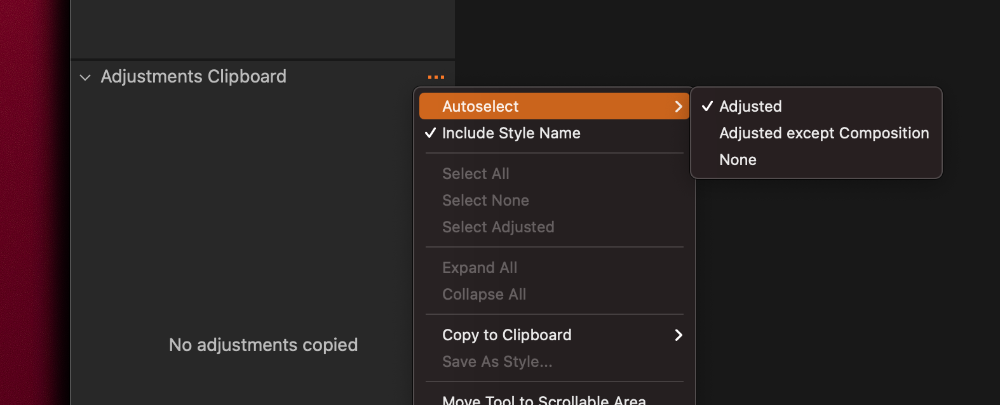

# C1 Batch Copy And Apply

## Installation

1. Copy the script file into `~/Library/Scripts/Capture\ One\ Scripts`

    > you can open this folder from C1 menu Scripts > Open Scripts Folder

2. In Capture One 22 choose Scripts > Update Script Menu

## Usage

1. In C1 select all files variants you want to copy settings from and those you want to copy setting to

    > e.g all RAF+JPG pairs

2. In C1 choose Scripts > C1 Batch Copy And Apply

## Notes

Works in Capture One 22.

My use case was to copy composition settings from JPGs to RAF files. In order to batch copy composition settings I had to go to Adjustments Clipboard tab and enable `Adjusted` option instead of `Adjusted Except Composition`:

Then in the script I `set editedFileExtension to "jpg"` which is the extension of the files to copy from. The script copies all of the variant settings to the parent image of the variant (which in my case is the RAF file).
